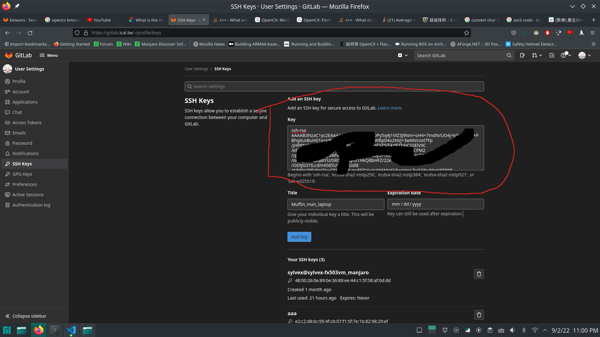

# K-means & C++ Tutorial & Opencv

K-means，c++和opencv的教學

這個教學是提供給擁有一定基礎程式語言的喵喵\
會嘗試把一點點的C++的特色帶進來，讓喵喵們對於實驗室過高的寫程式門檻有一點概念\
不至於說看到實驗室的程式碼覺得：喵的這個到底是在衝三小

## 第零章 如何設置git

如果不能git clone專案的話：
### 下載git

```
sudo apt-get install git
```

### 設置git ssh-keygen

```
ssh-keygen
```
一路enter就好 不要管什麼passphrase和路徑 (enter時會依據括號的預設值)\
然後：

```
cat ~/.ssh/id_rsa.pub
```
以顯示公鑰 要從ssh-rsa開始複製起 \
將下方出來的公鑰複製到gitlab -> 右上頭貼 ->左方SSH Keys -> Key大格子裡面 \
（終端機複製如果不會的話 請滑鼠框選並ctrl-shift-c) \
如下圖匡選所示：\

Title填能夠辨認你的電腦本體：如Tom_laptop_Asus \
Expiration Date先不要動

### 設置git config

```
git config --global user.name "你的學號"
git config --global user.email "你的學校信箱"
```
之後再試試看git clone

## 第一章 如何建置專案

最基本的步驟\
複製專案到你想要的位置並進到專案裡面：

```
git clone git@gitlab.ical.tw:a1085125/basic_tutorial.git
cd basic_tutorial
```
開始編譯：

```
mkdir build
cd build
cmake ..
make -j4
./ch1
```

指令解釋：
- ```git clone {url}```: 利用git複製gitlab/github專案
- ```cmake ..```: ```cmake```指令根據指定路徑找到CMakeLists.txt（..代表上一層），\
設置專案，產生出Makefile（和一些快取檔）在你當前的目錄。
- ```make```: 根據Makefile編譯並產生出可以被電腦執行的二進制執行檔\
 -j4代表使用4個執行序在做編譯這件事情
- ```./{執行檔}```：執行執行檔

什麼時候用```cmake ..```?
- 大多數都應概在build資料夾裡面執行
- 剛拿到專案或是你有新增檔案的時候

什麼時候用```make -j4```?
- 在有Makefile的時候執行
- 檔案有任何更動的時候

ch1的程式我暫時不會說在做什麼\
程式照著上面執行 能夠跑出灰色模糊的人臉就好\
ch2開始我才會開始講程式碼

課後練習：\
上面做完應該會出現灰色的迪亞波羅\
要怎麼召喚貓咪拯救世界呢？\
提示：
環境變數或是更改讀取路徑

## 第二章 Opencv基本操作

- 讀檔 imread
- 模糊 blur
- Canny濾波 canny
- 縮放 resize
- 圖片格式轉hsv,並二值化
- 鍵盤中斷 waitKey(0)
- 關掉所有視窗 destroyAllWindows();

opencv是圖像處理的套件\
擁有C++和python的接口\
基本上就是更改參數和名稱，看看圖片有什麼變化\
hsv轉換那邊是將圖片由預設的bgr轉成hsv色彩空間\
opencv大多數在操作的彩色相片都是bgr格式

課後練習：\
上網搜尋opencv的api\
嘗試使用GaussianBlur,以hsv二值化濾色後，使用morphology和findcontours找出最大紅色的物體\
並知道上述這些函式的意義。

## 第三章 C++基本操作

- cin輸入 cout印出
- string操作
- 一維陣列
- 二維陣列

C++基本上是C語言的超級強化版\
但因為功能太複雜很容易迷失方向，就連我也是\
這邊基本上只是簡單的說明一下C++的基本操作\
大致上C的寫法可以照搬到C++（可能有少數例外），相反大多數的時候不行

- cin/cout是輸入輸出的函式 和C語言的printf()/scanf()很像，但不用宣告輸入，輸出格式
- string是一個字串的類別 和C語言的char[]很像，只是額外新增了更多的功能
- 這裡的陣列還是簡單的c的array陣列，不過這邊有一個很重要的觀念，就是陣列的大小是固定的。\
怎麼動態調整陣列大小，要怎麼傳陣列進函式或是回傳一個陣列，志宏會教（和pointer, heap有關）

課後練習：\
寫一個程式，算出物體掉落第1~n秒時,落下的速度和位置\
將速度和位置存入個別double陣列，索引值為整數秒。\
查詢得出第幾秒的位置和速度分別為何

## 第四章 C++中階操作

- vector
- struct
- class

這邊主要是帶入C和C++不同的地方
- c++的vector是特有的一種資料結構，算是c++裡面最泛用的一種容器，大多數用array的地方在C++裡面都會強力建議使用vector，簡單來說就是可以動態調整大小也不需要事先宣告大小的array
- vector基本上很多時候放任何東西有可能都能行得通，像是cv::Mat,再包一個vector變成二維陣列，或甚至你自己寫的struct或是class都可以
- struct和class基本上是一樣的東西，只是一個成員預設為public另一個是private
- 今天建立一個struct/class，成員private的意思是你還是不能直接使用或是更改該成員（例如：不能用private的函式，不能改裡面的值）
- C語言裡面沒有class，struct不能直接放function，要使用function pointer才能做所謂的封裝
- 通常實務上class所有的資料都是private，只會留下想要給別人使用的函式。struct通常不會放函式

課後練習：\
制定一個class，可以n*m的```vector<vector<int>> data```二維陣列\
其中n為學生數量，m為科目數量。\
可以查尋，更改學生成績\
也可以隨時新增學生和其成績，及取得學生個數\
查詢,更改都是利用```data[i][j]```(第i個學生第j個科目的成績)

## 第五章 C++進階

- passed by value
- passed by pointer
- passed by reference

如果不懂我在講什麼，這裡是結論：\
遇到```*```或是```＆```就算在沒有return的情況下你的東西有可能會變，看實驗室的程式碼要注意這個細節\
其他等志宏教，隨著學期的進展你們會慢慢知道這個東西是什麼

（Note：其實你們目前遇到的東西都是初階，實驗室門檻是真的高）

課後練習：\
利用pointer或是reference以array實作出可以不斷地從尾部新增元素的vector。

## 第六章 K-means演算法

K-means是一種非監督式演算法。\
首先```{{123,24,31},{154,52,64},{3,12,54},{24,15,32}}```先把這個二維陣列當成4筆3維的資料，大致上可以類比成四個{r,g,b}格式的像素\
我們要從十萬到千萬筆的多維資料中，找到k個群中心，使得k個群中心能夠最好的代表這個資料＼
用照片來比喻的話就是我們要找到k個最能夠代表圖片的顏色啦！\
等等會藉由處理二維陣列的多筆n維資料，找到k個最好的中心的K-means演算法開始\
接著會說明怎麼和opencv的像素點做串接。