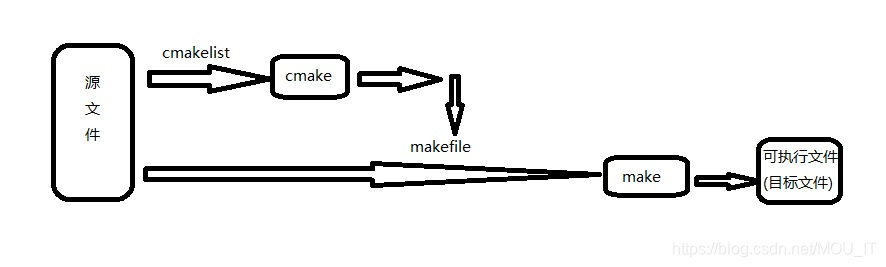

# CMake 教學

在介紹 cmake 之前，必須先介紹c語言在Linux如何被編譯。


__Preprocessing__ 

 即將 #define 刪除，展開所有巨集。將所有 #include 的檔案插入。處理 #if/#ifdef 等的 conditional 指令。刪除所有註解。添加行號。preprocessing 完後會產生 .i 檔


__Compilation__

_該階段編譯器會檢測程式碼中的錯誤，絕大多數的錯誤和警告產生在這個過程中_

編譯過程就是對預處理完的檔案進行一系列的詞法分析，語法分析，語義分析及優化後生成相應的彙編程式碼。compilation 完後即會產生組合語言碼


__Assembly__

將彙編程式碼轉換為機器指令(二進位制指令)，也就是從 xxx.s 變成 xxx.o。並且會生成符號表，依賴編譯階段的符號彙總，會給每一個符號分配一個地址，所以程式碼中的全域性變數、靜態變數會在該階段分配好儲存空間。


__Linking__

則是將程式所有會用到的 .o 檔做連結。由於 .o 檔是個別編譯的，因此在 .o 檔中並沒有參考到其它 .o 檔變數或函式的真正位址。linker 的目的除了連結所有 .o 檔，也會計算出每個變數或函式的真正位址，然後將所有參考到這些變數或函式的地方填上這個位址。這個動作就叫做 relocation。linking 完後最後就會產生執行檔


## 使用gcc進行編譯

### gcc 簡單編譯
到 `./hello` 資料夾以gcc進行編譯，執行以下指令
```shell
gcc hello.c
```
可以發現資料夾底下輸出了`a.out`的執行檔。那如果我們想產生目標檔(object file)來進行其他步驟，而且執行檔的檔名也不要用預設的`a.out`，那我們可以執行以下兩行指令。

```shell
gcc -c hello.c
```

可以看到資料夾底下多了`hello.o`的檔案

```shell
gcc -o hello hello.o
```

執行完後可以看到`hello`的執行檔

---

### 主副程式連結

如果我們在一個主程式呼叫令一個副程式，就像計程那堂課程一樣，老師要求不能將所有的function打在`main.c`而是要拆出許多的`.c`檔與`.h`檔。那我們應該如何做呢？

請到`./thanks`資料夾，執行以下兩行指令

```shell
gcc -c thanks.c thanks_2.c
gcc -o thanks thanks.o thanks_2.o
```

所以說由於我們的原始碼，並非只有單一一個檔案，所以我們無法直接編譯。這時我們就必須先產生目標檔案，然後以連結的方式，製作成binary可執行檔。如果有一天，更新了`thanks_2.c`，我們只需要重新編譯`thanks_2.c`檔即可。

----

### 連結外部函式庫

到 `./image`的資料夾，在這個範例程式中我`#include<opencv2/opencv.hpp>` ，當要編譯這支程式時就必須連結外部函式庫，執行以下兩行指令，就可以看到執行檔

```shell
g++ image.cpp -o image2 -I/usr/include/opencv4/opencv -I/usr/include/opencv4 -lopencv_stitching -lopencv_aruco -lopencv_bgsegm -lopencv_bioinspired -lopencv_ccalib -lopencv_dnn_objdetect -lopencv_dnn_superres -lopencv_dpm -lopencv_highgui -lopencv_face -lopencv_freetype -lopencv_fuzzy -lopencv_hdf -lopencv_hfs -lopencv_img_hash -lopencv_line_descriptor -lopencv_quality -lopencv_reg -lopencv_rgbd -lopencv_saliency -lopencv_shape -lopencv_stereo -lopencv_structured_light -lopencv_phase_unwrapping -lopencv_superres -lopencv_optflow -lopencv_surface_matching -lopencv_tracking -lopencv_datasets -lopencv_text -lopencv_dnn -lopencv_plot -lopencv_ml -lopencv_videostab -lopencv_videoio -lopencv_viz -lopencv_ximgproc -lopencv_video -lopencv_xobjdetect -lopencv_objdetect -lopencv_calib3d -lopencv_imgcodecs -lopencv_features2d -lopencv_flann -lopencv_xphoto -lopencv_photo -lopencv_imgproc -lopencv_core
```

又或者透過pkg-config 指令取得opencv 編譯所需要的參數，進行編譯

```shell
g++ image.cpp -o image2 `pkg-config --cflags --libs opencv4`
```

當在終端機輸入`pkg-config --cflags --libs opencv4`可以發現第一行指令後面的參數就是由這個指令來的

```shell
$ pkg-config --cflags --libs opencv4
-I/usr/include/opencv4/opencv -I/usr/include/opencv4 -lopencv_stitching -lopencv_aruco -lopencv_bgsegm -lopencv_bioinspired -lopencv_ccalib -lopencv_dnn_objdetect -lopencv_dnn_superres -lopencv_dpm -lopencv_highgui -lopencv_face -lopencv_freetype -lopencv_fuzzy -lopencv_hdf -lopencv_hfs -lopencv_img_hash -lopencv_line_descriptor -lopencv_quality -lopencv_reg -lopencv_rgbd -lopencv_saliency -lopencv_shape -lopencv_stereo -lopencv_structured_light -lopencv_phase_unwrapping -lopencv_superres -lopencv_optflow -lopencv_surface_matching -lopencv_tracking -lopencv_datasets -lopencv_text -lopencv_dnn -lopencv_plot -lopencv_ml -lopencv_videostab -lopencv_videoio -lopencv_viz -lopencv_ximgproc -lopencv_video -lopencv_xobjdetect -lopencv_objdetect -lopencv_calib3d -lopencv_imgcodecs -lopencv_features2d -lopencv_flann -lopencv_xphoto -lopencv_photo -lopencv_imgproc -lopencv_core

```


## 使用Make進行編譯

從以上的例子不難發現，當我們要連結許多外部的函式庫，使用gcc進行編譯，將會花費大量的時間撰寫編譯指令，所以為了解決這個問題，於似乎make 就誕生了，那在使用make之前，比須擁有`Makefile` 的檔案，裡面寫著用來確定target檔案的依賴關西，然後把生成這個target的相關命令傳給shell去執行。此外make可以主動的判斷那一個原始碼與相關的target檔案有更新過，並僅更那個檔案，如此一來可大大節省很多編譯的時間。

以下範例在`./make_hello`的資料加當中，請執行以下指令

```shell
make
```

執行完後就可以看到執行檔


__那這次的教學主要目的不是要教Makefile怎麼寫，所以我就不寫相關的教材了（真是抱歉啦！！），因為如何寫一個Makefile又是另一大學問了。只是希望讓大家大致上了解`make`這個工具的用途，以及使用方式，以及cmake的原理。如果對Makefile有興趣的人可能就要麻煩各位自己上網查資料囉！！__

---

### CMake 介紹
是個一個開源的跨平台自動化建構系統，用來管理軟體建置的程式，並不依賴於某特定編譯器。然而CMake並不直接建構出最終的執行檔，而是產生標準的建構檔（如Unix的`Makefile`或Windows Visual C++的`projects/workspaces`），然後再依一般的建構方式使用。那cmake在使用時必須有`CMakeLists.txt`用來幫助我們建造`Makefile`，產生`Makefile`之後就可以使用make工具來建執行檔。

那在./hello的資料夾中我已經寫好一個最簡單的`CMakeLists.txt`，那執行以下指令（切記後面有一個點（.）），即可生成Makefile檔，以及CMake的相關檔案，接著再使用make進行編譯，最後得到執行檔

```shell
cmake .
make
```

__cmake . 後面的那一個點代表著`CMakeLists.txt`的位置__

試完之後接著將`cmake .`換成`ccmake .`可以發現ccmake 算是cmake 的gui工具，所以說ccmake是基於cmake 開發而成的工具。

接著我們來看看`CMakeLists.txt`

```cmake
cmake_minimum_required(VERSION 3.2)

project(ex1)
add_executable(ex1 hello.c)
```

在這個檔案中最後一行的指令`ex1`就是執行檔的檔名，那`hello.c`就是有`main function`的`.c`檔，從這個範例是不是可以發現，CMake比起make又更加直觀了呢。


以下展示CMake與make的流程


